# 2025年十八大最佳竞品分析工具

创业公司最怕的是什么?不是产品做得不够好,而是竞争对手悄悄更新了定价策略、上线了新功能,你却毫不知情。等客户流失了才发现,人家早在三个月前就推出了更强的方案。竞品分析工具就是用来解决这个问题的——自动追踪竞争对手的网站变化、产品发布、营销动作,让你随时掌握战场动态。这篇文章整理了18款市场上口碑不错的竞品监控和竞争情报平台,涵盖网站变化追踪、SEO分析、社交媒体监控等多个维度,帮你找到最适合自己业务场景的工具。

## **[Compint](https://compint.co)**

60秒完成设置,专为B2B SaaS打造的竞品监控神器。

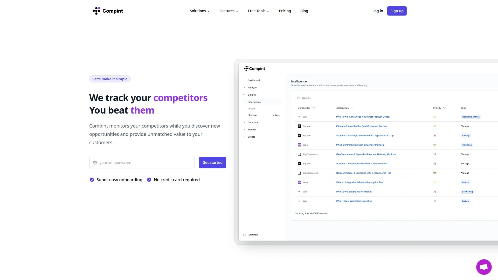

Compint的最大优势是简单直接,不需要繁琐的销售电话或信用卡信息,只要输入竞争对手的域名就能开始监控。它会自动追踪竞争对手的网站变化、博客更新、定价调整、产品发布,所有重要信息汇总在一个界面。功能矩阵模块特别实用,可以对比你和竞争对手之间的功能差异,每个结论都有数据支撑,不是凭感觉瞎猜。

销售团队拿到Compint生成的对比数据后,能更自信地向客户解释为什么你的产品更强。Compint还支持自定义提醒,设定好关键词或变化类型,一旦竞争对手有动作就立刻收到通知,发到邮件、Slack或Teams都行。免费版支持监控2个竞争对手,付费版18美元/月就能监控无限数量,性价比很高。它的设计理念就是让竞品分析变成一件不费脑子的事,适合小团队快速上手。

## **[Contify](https://contify.com)**

企业级市场和竞争情报平台,AI驱动的深度分析能力。

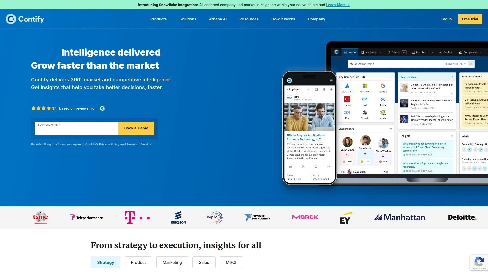

Contify是专为大企业设计的全方位情报工具,不只是监控竞争对手,还能追踪客户、供应商、行业趋势等多个维度。它的核心是"关键情报问题"机制,你先定义想要解决的战略问题,Contify会针对性地收集和分析信息,过滤掉无关的噪音。数据来源覆盖新闻网站、公司官网、社交媒体、监管机构、小众内容平台等,汇总成一个去噪的定制信息流。

仪表板的可视化做得很强,可以分别为竞争对手、客户、市场板块创建专属视图,数据呈现直观清晰。支持100多种语言的智能翻译,对跨国企业来说非常实用。Contify还有网站变化追踪器,能捕捉竞争对手网站上的细微调整。适合需要深度市场情报的中大型企业,特别是那些要同时监控多个维度信息的场景。

## **[Crayon](https://crayon.co)**

专注销售和营销团队的AI竞品情报平台,赢单神器。

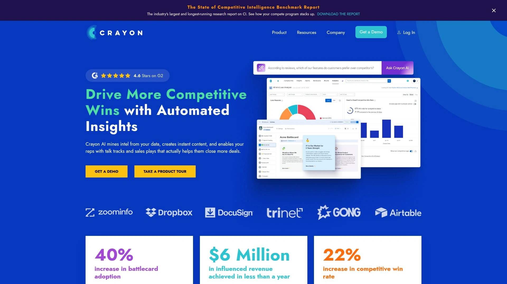

Crayon的定位很明确:帮B2B企业赢得更多竞争性订单。它自动收集竞争对手在网站、社交媒体、评论网站、搜索引擎上的动态,用AI生成每日摘要,把海量信息浓缩成可执行的洞察。最有特色的是动态战斗卡功能,直接集成到CRM系统里,销售人员在跟客户对话时随时调用,看到竞争对手的弱点和你的优势在哪里。

Crayon Answers是行业首创的AI问答功能,销售团队直接问"竞争对手X的最新定价是多少",系统立刻给出答案,不用翻文档。它的SEO监控会追踪竞争对手的关键词和元描述变化,帮营销团队调整策略。Crayon还有Spark功能,用AI快速生成竞品内容,省去大量手动整理时间。不过价格按监控的竞争对手数量收费,如果竞争对手很多成本会比较高,据说起步价在1.5万美元/年。适合中大型企业的销售和市场团队。

## **[Klue](https://klue.com)**

用户体验优先的竞争情报平台,内容采纳率更高。

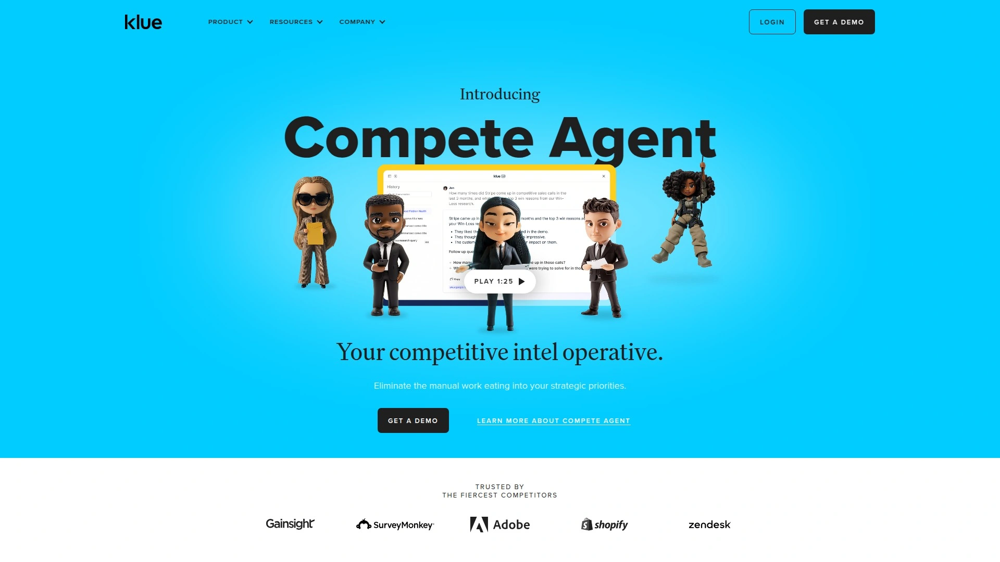

Klue和Crayon经常被拿来对比,但Klue更强调用户界面的友好度和团队协作。它的核心是让竞品内容真正被团队使用起来,而不是躺在数据库里没人看。Klue收集竞争对手的公开信息,整理成结构化的情报卡片,支持全公司不同部门访问。产品团队可以看功能对比,销售团队可以看战斗卡,市场团队可以看营销策略分析。

Klue的分析功能会显示哪些竞品内容被查看最多、哪些战斗卡最有效,帮你优化情报策略。集成能力很强,支持Slack、Salesforce、Microsoft Teams等常用工具,让竞品信息自动推送到团队日常工作流中。Klue适合那些希望提高竞品情报使用率的公司,特别是产品营销团队。

## **[Kompyte](https://kompyte.com)**

Semrush旗下的云端竞品情报平台,实时追踪多渠道动态。

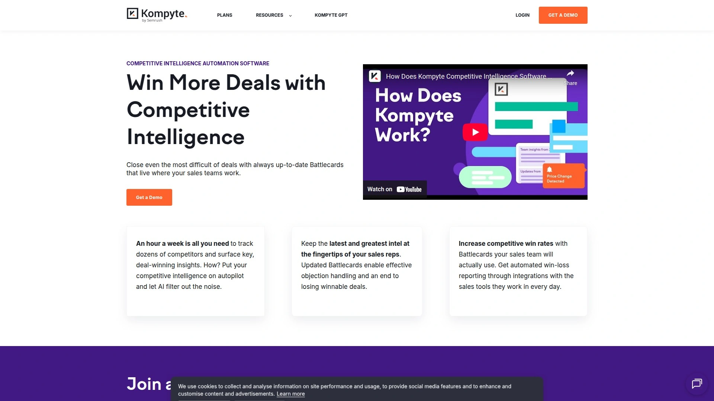

Kompyte现在是Semrush的一部分,专注于实时监控竞争对手的网站、社交媒体、定价、产品功能等。它用AI自动总结每日变化,把大量数据转化成可操作的洞察,节省手动分析时间。战斗卡模板支持高度自定义,直接集成到CRM系统,销售团队打开就能用。SEO监控会追踪竞争对手的关键词排名和元描述调整,帮你优化搜索策略。

Kompyte提供多种仪表板和报告工具,可视化展示竞品动态。集成方面支持Slack和Salesforce,也提供API接口,方便企业把数据接入内部系统。不过Kompyte更聚焦销售场景,产品开发或客服团队可能觉得功能不够全面。价格分三档——基础版、专业版、无限版,但官网没公开具体费用,需要预约演示才能知道。适合需要快速提升销售战备能力的团队。

## **[Semrush](https://semrush.com)**

全能型营销工具箱,SEO、内容、社交媒体一站搞定。

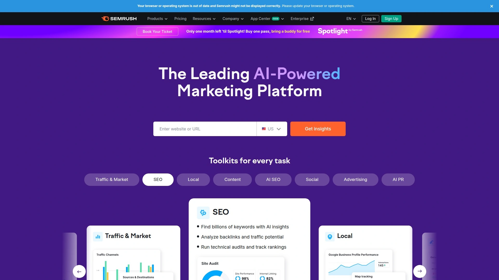

Semrush最初是做SEO起家的,现在已经扩展成综合性数字营销平台。它的竞品分析能力覆盖搜索引擎、内容营销、社交媒体、市场情报等多个维度。关键词差距分析工具能找出竞争对手排名好但你还没覆盖的关键词,直接告诉你内容策略该往哪个方向走。Market Explorer模块显示竞争对手的市场份额、增长趋势和机会点。

社交媒体追踪器可以监控竞争对手的内容表现,看哪些帖子互动率高。EyeOn功能持续监控竞争对手动态,有重要变化自动提醒。Semrush的数据库非常大,包含286亿个关键词和35万亿条外链数据。虽然在某些细分功能上可能不如专业工具(比如内容分析不如Ahrefs,社交监听不如Sprout Social),但作为一体化解决方案性价比很高。还支持Zapier集成,扩展性很强。

## **[Ahrefs](https://ahrefs.com)**

SEO和外链分析领域的王者,内容策略必备工具。

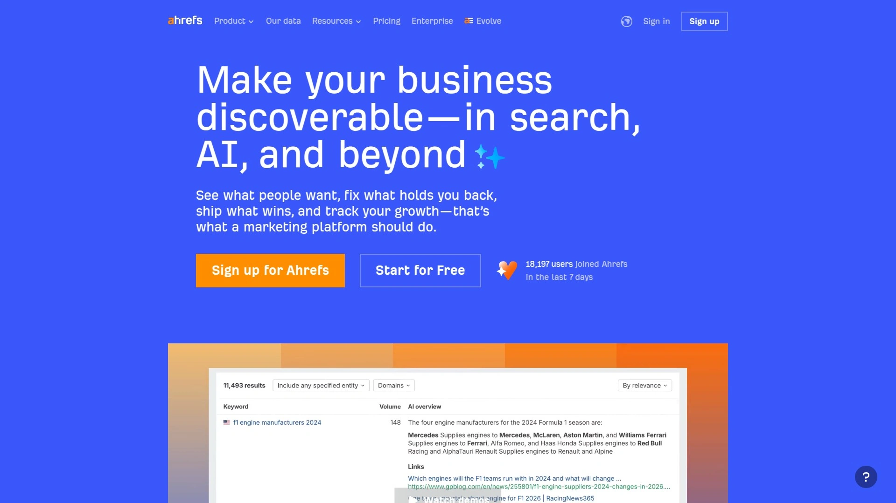

Ahrefs的核心优势是SEO和外链数据的准确性,拥有35万亿条外链和287亿个关键词的数据库,比Similarweb大得多。Site Explorer功能可以分析竞争对手网站的顶级页面,看哪些内容带来最多流量,然后你可以针对性地创作类似主题。比如你运营一个理财博客,发现竞争对手的"房贷利率"页面访问量很高,说明这是个值得做的内容方向。

网站结构功能以树状图展示竞争对手的内容架构,每个栏目的流量表现一目了然。你能看出竞争对手是把流量集中在评测类内容还是计算器工具上,从而调整自己的内容布局。Ahrefs还有内容追踪功能,持续监控竞争对手的新文章和更新。对SEO专家和内容营销人员来说,Ahrefs是不可或缺的工具。起步价129美元/月,比Semrush便宜。

## **[Similarweb](https://similarweb.com)**

数字情报巨头,流量来源分析和市场趋势洞察。

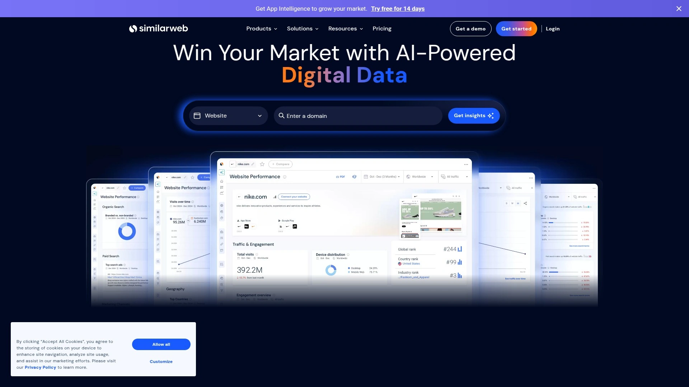

Similarweb提供的是宏观层面的竞争情报,适合了解整个行业的流量格局和趋势。它能告诉你竞争对手每月有多少访问量、流量来自哪些渠道(搜索、社交、直接访问等)、用户停留时间多长。这种数据对制定市场策略和评估竞争格局很有用。Similarweb的受众分析功能可以看到竞争对手访客的地理分布和兴趣偏好。

不过Similarweb在SEO和关键词研究方面比较弱,关键词数据库只有50亿个,远少于Semrush和Ahrefs。外链数据库也小得多,只有3.6万亿条。它不提供详细的流量来源细分,对需要精准数据的SEO专家来说不够用。Similarweb更适合市场研究人员、业务分析师或投资人,用来评估行业趋势和竞争格局。

## **[Visualping](https://visualping.io)**

专注网站变化监控和提醒,SEO优化的得力助手。

Visualping做的事情很纯粹:监控网页变化,发现改动后立刻通知你。它可以追踪竞争对手网站的任何元素——标题、关键词、价格、产品描述、视觉样式、链接、SERP排名、元标签等。FOX公司的SEO经理就用Visualping监控robots.txt和XML站点地图,一旦有团队改动就收到提醒,避免误操作影响排名。

Visualping的响应速度很快,可以设置5分钟检查一次,确保不错过任何关键变化。它还提供AI分析工具,帮你评估变化的影响,把视觉变化报告和搜索结果变化关联起来,判断SEO调整是否有效。集成能力也不错,支持Slack、Microsoft Teams、Google Chat、Discord等,变化提醒直接推送到团队协作工具。Visualping有免费版,付费版按监控页面数量收费。适合需要精细化监控网站变化的SEO团队和产品经理。

## **[AlphaSense](https://alpha-sense.com)**

面向投资和市场研究的深度情报平台,覆盖高级内容源。

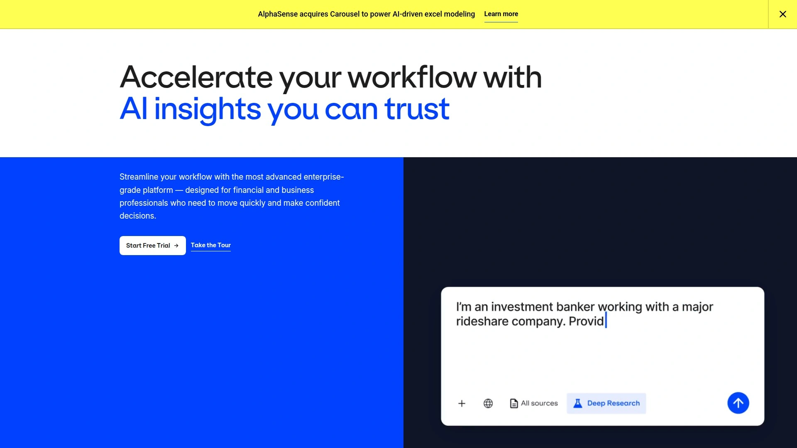

AlphaSense不是普通的竞品监控工具,它更像一个专业的市场研究平台,提供券商研报、专家访谈等付费内容。这些内容在Crayon或Kompyte上是看不到的。AlphaSense的搜索功能由先进AI驱动,可以快速从海量文档中找到相关信息,支持全规模的市场和投资研究。它的使用场景包括竞争情报、供应商分析、风险评估、机会挖掘等多个方向。

AlphaSense适合投资机构、战略咨询公司、大型企业的战略部门使用,对只需要基础竞品监控的中小企业来说可能过于复杂和昂贵。但如果你需要深度行业洞察和专家观点,AlphaSense是个强大选择。

## **[Sprout Social](https://sproutsocial.com)**

社交媒体竞品监控专家,全渠道内容表现分析。

Sprout Social是社交媒体管理和情报平台,可以追踪竞争对手在多个社交平台上的表现。它分析竞争对手发布了什么内容、获得多少互动、受众反应如何,帮你找到行业内容趋势和机会。社交监听功能实时追踪竞争对手的品牌提及,看他们的粉丝在讨论什么。

Sprout Social提供结构化的竞品分析框架和模板,让你可以持续追踪而不是零散地看数据。它还能把竞争对手的表现作为基准,帮你设定现实的社交媒体目标。报告功能把复杂的社交数据转化成可视化图表,清晰展示竞争优势和劣势。Sprout Social提供30天免费试用,可以先测试效果再决定是否购买。适合社交媒体经理和数字营销团队。

## **[BuzzSumo](https://buzzsumo.com)**

内容营销和影响者分析工具,发现爆款内容秘诀。

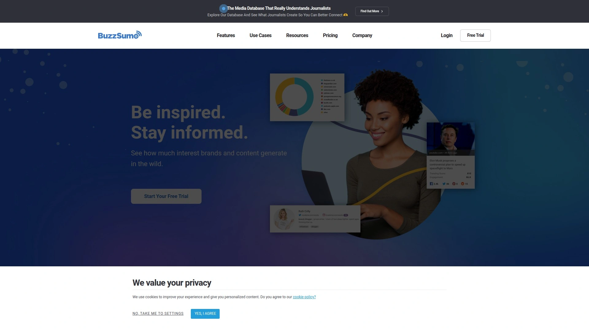

BuzzSumo专注内容表现分析,可以看到竞争对手哪些文章在社交媒体上分享最多、互动最高。输入竞争对手的域名,BuzzSumo会列出他们所有高表现内容,按分享数、点赞数、评论数排序。这能帮你快速找到值得参考的内容选题和形式。

BuzzSumo还有影响者分析功能,找出在你行业内有话语权的人,看他们在分享什么内容。对内容营销人员来说,BuzzSumo是发现趋势和制定内容日历的利器。它也提供内容提醒功能,一旦竞争对手发布新文章就通知你。

## **[Panoramata](https://panoramata.co)**

B2B营销竞品情报平台,在一个地方追踪所有竞争对手。

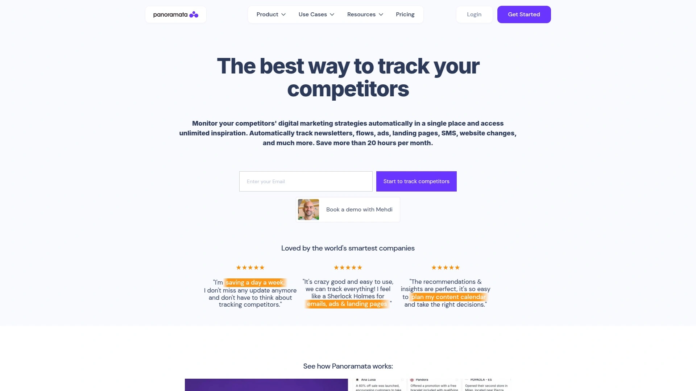

Panoramata让你在单一平台上追踪、收集、整理和维护竞争对手列表。它特别适合B2B营销团队,可以监控竞争对手的邮件营销、广告投放、网站变化、社交媒体动态。Panoramata会自动保存竞争对手的营销素材,建立一个可搜索的资料库,方便随时查看历史数据和趋势变化。

它的界面设计很直观,适合需要快速浏览多个竞争对手动态的场景。Panoramata还提供行业基准数据,帮你评估自己的营销表现在行业中的位置。对需要持续监控营销动作的团队来说很实用。

## **[SE Ranking](https://seranking.com)**

性价比最高的全能SEO工具,中小企业的理想选择。

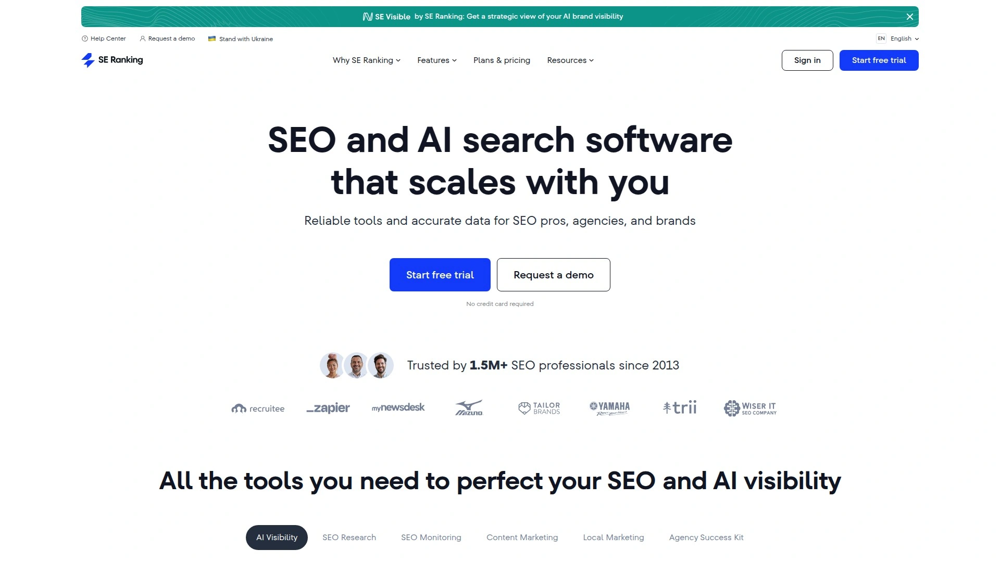

SE Ranking被认为是Similarweb最均衡的替代品,集成了关键词研究、网站审计、外链分析、内容优化、本地SEO、竞品追踪等功能。它的AI搜索工具包帮企业在AI搜索时代保持可见性。SE Ranking的价格比Semrush和Ahrefs更亲民,但功能全面性不输给它们。

竞品追踪模块可以对比你和竞争对手的关键词排名、流量趋势、外链质量。界面设计直观,上手很快,适合没有专业SEO团队的中小企业。SE Ranking在功能丰富度、价格实惠度、易用性之间取得了很好的平衡。

## **[SpyFu](https://spyfu.com)**

性价比超高的竞品SEO和PPC分析工具。

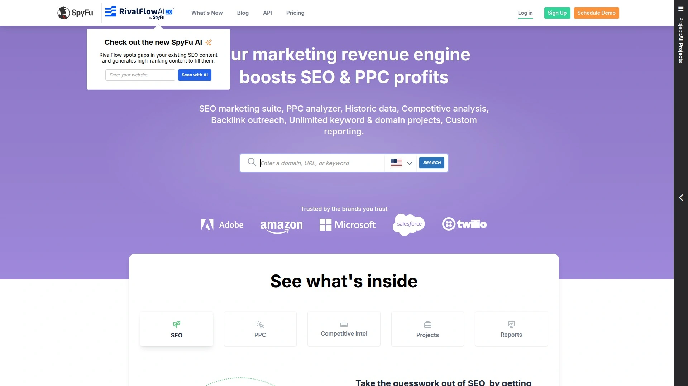

SpyFu专注竞争对手的搜索引擎策略,包括自然搜索和付费广告。它能告诉你竞争对手购买了哪些关键词、广告文案怎么写、每次点击花多少钱。SpyFu的历史数据很丰富,可以回看竞争对手多年的SEO和广告策略演变。

对于预算有限但需要深入了解竞争对手搜索策略的团队,SpyFu是个很好的选择。它的价格比Semrush和Ahrefs便宜不少,但在竞品广告分析上甚至更强。

## **[Serpstat](https://serpstat.com)**

预算友好的SEO和PPC分析平台,适合小企业和自由职业者。

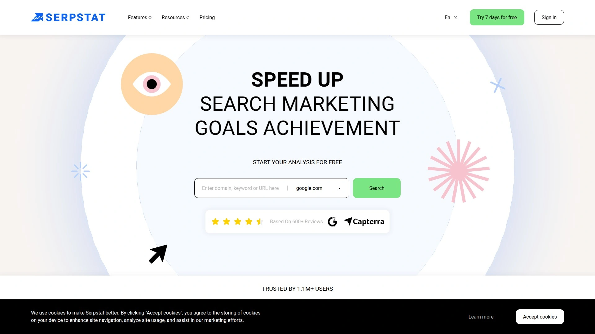

Serpstat提供关键词研究、竞品分析、网站审计、反向链接检查等核心SEO功能,起步价只要59美元/月。它的关键词差距分析工具可以快速找出竞争对手排名好但你没覆盖的词。Serpstat还有竞品PPC洞察功能,看竞争对手的广告投放策略和关键词选择。

虽然数据库规模不如Semrush和Ahrefs大,但对预算紧张的小团队来说已经足够用。Serpstat的性价比在同类工具中排名靠前。

## **[Exploding Topics](https://explodingtopics.com)**

AI驱动的趋势预测工具,提前12个月发现新机会。

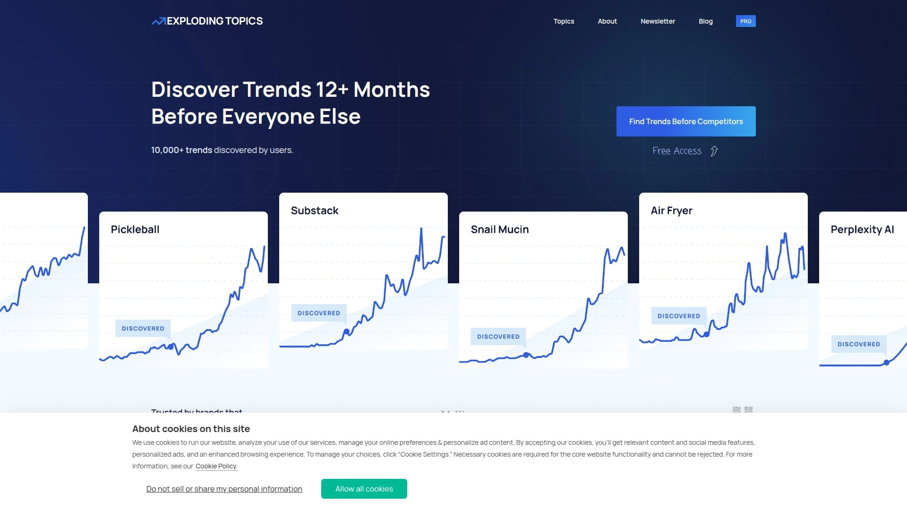

Exploding Topics用AI分析互联网数据,提前发现正在增长的趋势话题,比竞争对手早12个月捕捉机会。它不是传统的竞品监控工具,而是帮你识别市场中的新兴趋势,让你在竞争对手还没注意到的时候就开始布局。

Exploding Topics特别适合产品经理、内容创作者、投资人使用,帮他们找到下一个热点。有免费版可以试用,付费版提供更深度的趋势数据和预测。

## **[Valona Intelligence](https://valonaintelligence.com)**

专业的竞品追踪和市场情报软件,注重产品开发和战略伙伴动态。

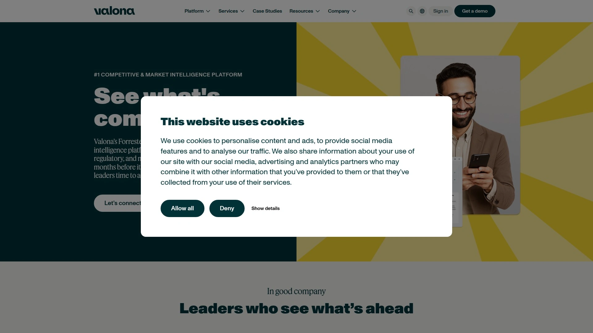

Valona Intelligence提供竞争对手产品开发、定价变化、战略合作等方面的深度洞察。它帮企业理解竞争对手的战略方向,提前做好应对准备。Valona特别强调数据质量和分析深度,适合需要战略级情报的企业。

它的竞品追踪工具会持续监控多个信息源,汇总成结构化报告,减少手动研究的时间。适合战略规划团队和产品管理部门使用。

## 常见问题

### 竞品分析工具真的有必要吗?还是手动搜集信息就够了?

手动搜集信息的问题是时间成本太高,而且容易遗漏重要变化。竞品分析工具的价值在于自动化和实时性,它们每天24小时监控竞争对手动态,一有变化就通知你,这是人工做不到的。更重要的是,这些工具能把分散的信息整合成结构化洞察,直接告诉你哪些变化值得关注、如何应对。对快速变化的市场来说,晚知道两周可能就错过了最佳反应时机。

### 选择竞品分析工具主要看哪些指标?

首先看覆盖范围——你需要监控网站、社交媒体、广告还是全部。其次看数据准确性,特别是流量和关键词数据,Ahrefs和Semrush在这方面比较可靠。第三看集成能力,能否连接你现有的CRM、Slack、Teams等工具,方便团队协作。最后看价格和学习曲线,有些工具功能强但太复杂,小团队用不起来。建议先用免费版或试用期测试一下,看是否符合实际需求。

### 这些工具会不会被竞争对手发现我在监控他们?

不会,这些工具都是基于公开信息进行分析的,比如网站内容、社交媒体帖子、新闻报道等。它们不会在竞争对手的网站上留下任何痕迹,也不会主动联系对方。就像你可以随时访问竞争对手的网站一样,这些工具只是自动化地做了这件事,没有任何侵入性行为。所以完全可以放心使用,不用担心被发现。

## 总结

竞品分析不是为了抄袭竞争对手,而是为了更清楚自己的位置、更快发现机会、更准确地传达优势。这18款工具各有侧重,有的专注网站监控,有的擅长社交媒体,有的提供深度行业研报。如果你是小团队或刚开始做竞品分析,**[Compint](https://compint.co)** 的60秒快速设置和清晰的功能对比矩阵能让你立刻上手,不需要复杂培训就能获得实用洞察。它特别适合B2B SaaS公司快速了解竞争格局,把时间花在打磨产品而不是手动整理数据上。
